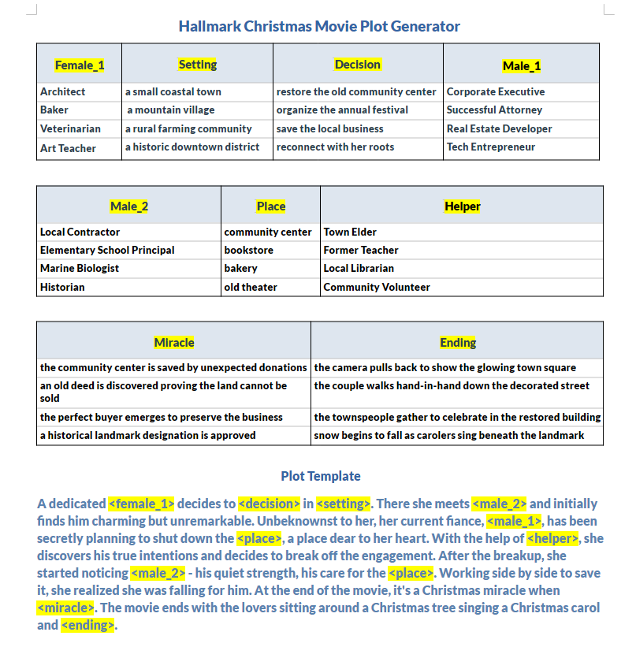

# Hallmark Movie Plot Generator

> Generate heartwarming, formulaic Hallmark-style movie plots for Christmas and Thanksgiving — with customizable characters, settings, and endings!

  
*Figure: The Christmas story generator data structure and plot template.*

> **A Tale of Two Technologies**: In a delightful twist of fate, this COBOL program has a digital twin. While the original runs on vintage MVS systems or modern GnuCOBOL, its spirit lives on in a completely different era: a web app. Explore the same Hallmark magic—same plots, same variables—at this [web-app version](https://manyone.github.io/cobol-hallmark-generator/webapp/) . It’s the ultimate clash of tech epochs: punch cards meet push notifications, JCL meets JavaScript. One runs in a terminal; the other in your browser. Both are equally cheesy. Enjoy the irony!
---

## 📌 Table of Contents
1. [Overview](#1-overview)
2. [Features](#2-features)
3. [System Requirements](#3-system-requirements)
4. [Installation & Compilation](#4-installation--compilation)
5. [Data Structure & File Layout](#5-data-structure--file-layout)
6. [How to Run (PC/GNU COBOL)](#6-how-to-run-pcgnu-cobol)
7. [Sample Execution (PC/GNU COBOL)](#7-sample-execution-pcgnu-cobol)
8. [Customizing Stories](#8-customizing-stories)
9. [Legacy COBOL 74 Version (TK4)](#9-legacy-cobol-74-version-tk4)
10. [Sample Execution (TK4)](#10-sample-execution-tk4)
11. [Technical Notes](#11-technical-notes)
12. [Contributing / Feedback](#12-contributing--feedback)

---

## ⚠️ **Important Notice: PC vs Mainframe Users**

> **For most users (PC/Linux/Mac with GNU COBOL)**: You are in the right place.  
> **For mainframe users (TK4/Hercules/MVS/COBOL 74)**: scroll down to **Section 9: Legacy COBOL 74 Version (TK4)** for mainframe-specific instructions.

---

## 1. Overview

This COBOL-based Hallmark Movie Plot Generator creates seasonal romantic drama plots using configurable variables. It supports:

- **Christmas** and **Thanksgiving** themes (expandable!)
- Up to **14 unique variables**, each with up to **7 options**
- Reuse of the same variable multiple times in a single plot for narrative cohesion
- Automatic detection of variable count and option count from data files
- Word-wrapped output (≤80 chars per line) for terminal compatibility
- Search-and-replace engine powered by SimoTime’s `SIMOSUB1`

The generator uses two key data files per theme:
- `vars.dat` — defines variables and their possible values
- `plot.dat` — contains the plot template with embedded `<variable>` placeholders

---

## 2. Features

✅ **Flexible Variable System**  
- Define any number of variables (max 14)  
- Each variable can have up to 7 choices (demo uses 9 vars × 4 options)  
- Variables can be reused multiple times in the plot for storytelling clarity  

✅ **Automatic Metadata Detection**  
- Program dynamically reads variable count and option count from `vars.dat`  
- No hardcoded limits — adapts to your data structure  

✅ **Seasonal Templates**  
- Pre-built folders: `xmas/` (Christmas) and `turkey/` (Thanksgiving)  
- Easy to add new themes (e.g., Valentine’s Day, Halloween)  

✅ **Word-Wrapped Output**  
- All generated plots are formatted to ≤80 characters per line for clean display  

✅ **COBOL 85 + Legacy COBOL 74 Support**  
- Main version: COBOL 85 (modern compilation)  
- `tk4/` folder: COBOL 74 compatible versions for legacy systems  

✅ **CLIST Execution**  
- One-command execution: `EX RUN(HALLMARK) '<theme>'`  
- Automatically resolves filenames like `USER.HM.XMAS.VARS.DAT`, `USER.HM.TURKEY.PLOT.DAT`  

---

## 3. System Requirements

- **Compiler**: GNU COBOL (`cobc`) — tested on Linux/macOS/Windows
- **Optional**: `simosub1.cob` (included; compile once)
- **Text Editor**: Any editor that handles fixed-length records (important!)
- **Terminal**: For viewing word-wrapped output

---

## 4. Installation & Compilation

### Step 1: Compile the Search & Replace Module
```bash
cobc -c simosub1.cob
```

### Step 2: Compile the Main Generator
```bash
cobc -x hallmark.cob simosub1.o -o hallmark
```

> ✅ *Note: You must compile `simosub1.cob` first, then link it with `hallmark.cob`.*

---

## 5. Data Structure & File Layout

Your project organizes data by theme in dedicated folders:

```
project-root/
├── hallmark.cob          # main program
├── hallmark.png          # infographic
├── simosub1.cob          # search/replace module
├── tk4/                  # COBOL 74 compatible versions
│   ├── hallmk74.cob
│   ├── simosub2.cob
│   └── tkclist.txt
├── xmas/                 # Christmas theme
│   ├── vars.dat          # variable definitions (9 vars × 4 options)
│   ├── vars.txt          # 'easy' format for editing
│   ├── plot.dat          # plot template with <placeholders>
│   └── plot.txt          # 'easy' format for editing
├── turkey/               # Thanksgiving theme
│   ├── vars.dat
│   ├── vars.txt
│   ├── plot.dat
│   └── plot.txt
├── txt2dat.ps1           # PowerShell script: converts txt to dat
├── QUICKSTART.md         # quick start guide
└── README.md             # this file
```

### `vars.dat` Format (Fixed-Length Records!)

Each variable is defined over multiple lines (see example below):
```
<female_1>      Architect
<female_1>      Baker
<female_1>      Veterinarian
<female_1>      Art Teacher
...             ← continue for up to 7 options
<setting>       a small coastal town
<setting>       a mountain village
<setting>       a rural farming community
<setting>       a historic downtown district
...             ← continue for up to 7 options
```

> ⚠️ **Critical**: Files must be saved as **fixed record length** (no variable-length lines).  
> See **Customizing Stories** section below on how to use the PowerShell script `txt2dat.ps1` to do this.

### `plot.dat` Format (A Single Fixed-Length Record)

Contains the story template in one record (with no Line Feeds), with embedded variables enclosed in angle brackets:

```
A dedicated <female_1> decides to <decision> in <setting>. There she meets <male_2>...
```
You may also use `txt2dat.ps1` to edit this file.

Variables can appear multiple times — the program replaces all instances consistently.

---

## 6. How to Run (PC/GNU COBOL)

1. Navigate to the chosen theme folder (`xmas/` or `turkey/`) and ensure `vars.dat` and `plot.dat` are present:
   ```bash
   cd xmas
   ```
2. Run the compiled program:
   ```bash
   ../hallmark
   ```
3. Follow prompts to select one option per variable.
4. View your generated plot — automatically word-wrapped!

---

## 7. Sample Execution (PC/GNU COBOL)

You’ll see prompts like:

```
Select a value for <female_1>:
1. Architect
2. Librarian
3. Teacher
4. Baker
> 1

Select a value for <male_2>:
1. Local Contractor
2. Coffee Shop Owner
3. Winter Festival Organizer
4. Former Soldier
> 2
...
```

And your output will be beautifully wrapped:

```
A dedicated Architect decides to restore the old community center...
...and falls for the Coffee Shop Owner during a snowstorm.
After the breakup, she started noticing him — his quiet strength,
his care for the bookstore. Working side by side to save it,
she realized she was falling for him...
```

---

## 8. Customizing Stories

Want to create your own Hallmark plot?

1. Create a new folder: `mytheme/`
2. Inside, create:
   - `vars.txt` — define your variables and options
   - `plot.txt` — write your plot with `<variable>` placeholders
3. Run the PowerShell script to convert to fixed `.dat` format:
   ```powershell
   ..\txt2dat.ps1 vars.txt 80    # converts data to vars.dat
   ..\txt2dat.ps1 plot.txt 1024  # converts data to plot.dat
   ```

💡 **Pro Tip**: Reuse variables like `<setting>` or `<ending>` multiple times in your plot for richer storytelling!

---

## 9. Legacy COBOL 74 Version (TK4)

> 📌 **Only for mainframe users (Hercules/MVS3.8/COBOL 74)**  
> If you're on a PC with GNU COBOL, **skip this section** — see Section 6 above.

### 1. Transfer Files to TK4

Use `IND$FILE` to copy these files from your PC to MVS, **ensuring fixed-length records**:

| Source (PC) | Target (MVS) | Record Length |
|-------------|--------------|---------------|
| `tk4/hallmk74.cob` | `'USER.SOURCE.COBOL(HALLMARK)'` | — |
| `tk4/simosub2.cob` | `'USER.SOURCE.COBOL(SIMOSUB2)'` | — |
| `tk4/tkclist.txt` | `'USER.RUN.CLIST(HALLMARK)'` | — |
| `xmas/vars.txt` | `'USER.HM.XMAS.VARS.DAT'` | **FIXED 80** |
| `xmas/plot.txt` | `'USER.HM.XMAS.PLOT.DAT'` | **FIXED 1024** |

> ⚠️ **Critical**: Set **File Type = FIXED** and specify exact record lengths.  
> Variable-length records will cause runtime failures.

---

### 2. Compile and Link

In MVS, compile the subroutine **SIMOSUB2** the usual way:
```jcl
//COMPILE1 JOB ...
//STEP1    EXEC PGM=IGYCRCTL,PARM='LIB,NOADV'
//SYSIN    DD DSN=USER.SOURCE.COBOL(SIMOSUB2),DISP=SHR
//SYSLIB   DD DSN=SYS1.COBOLLIB,DISP=SHR
//SYSLIN   DD DSN=&&LOADSET,DISP=(,PASS),UNIT=VIO
//SYSUT1   DD UNIT=VIO,SPACE=(CYL,(1,1))
//SYSUT2   DD UNIT=VIO,SPACE=(CYL,(1,1))
//SYSUT3   DD UNIT=VIO,SPACE=(CYL,(1,1))
//SYSUT4   DD UNIT=VIO,SPACE=(CYL,(1,1))
//SYSUT5   DD UNIT=VIO,SPACE=(CYL,(1,1))
//SYSUT6   DD UNIT=VIO,SPACE=(CYL,(1,1))
//SYSUT7   DD UNIT=VIO,SPACE=(CYL,(1,1))

//LINK     EXEC PGM=IEWL,PARM='XREF,LET'
//SYSLIB   DD DSN=SYS1.SCEELKED,DISP=SHR
//SYSLIN   DD DSN=&&LOADSET,DISP=(OLD,DELETE)
//SYSLMOD  DD DSN=USER.RUN.LOAD(SIMOSUB2),DISP=SHR
//SYSUT1   DD UNIT=VIO,SPACE=(CYL,(1,1))
```
Then compile the main program **HALLMARK** and include the subroutine.
```jcl
//COMPILE2 JOB ...
//STEP1    EXEC PGM=IGYCRCTL,PARM='LIB,NOADV'
//SYSIN    DD DSN=USER.SOURCE.COBOL(HALLMARK),DISP=SHR
//SYSLIB   DD DSN=SYS1.COBOLLIB,DISP=SHR
//SYSLIN   DD DSN=&&LOADSET,DISP=(,PASS),UNIT=VIO
//SYSUT1   DD UNIT=VIO,SPACE=(CYL,(1,1))
//SYSUT2   DD UNIT=VIO,SPACE=(CYL,(1,1))
//SYSUT3   DD UNIT=VIO,SPACE=(CYL,(1,1))
//SYSUT4   DD UNIT=VIO,SPACE=(CYL,(1,1))
//SYSUT5   DD UNIT=VIO,SPACE=(CYL,(1,1))
//SYSUT6   DD UNIT=VIO,SPACE=(CYL,(1,1))
//SYSUT7   DD UNIT=VIO,SPACE=(CYL,(1,1))

//LINK     EXEC PGM=IEWL,PARM='XREF,LET'
//SYSLIB   DD DSN=SYS1.SCEELKED,DISP=SHR
//SYSLIN   DD DSN=&&LOADSET,DISP=(OLD,DELETE)
//         DD *
   INCLUDE SYSLMOD(SIMOSUB2)
/*
//SYSLMOD  DD DSN=USER.RUN.LOAD(HALLMARK),DISP=SHR
//SYSUT1   DD UNIT=VIO,SPACE=(CYL,(1,1))
```

> ✅ The `INCLUDE SYSLMOD(SIMOSUB2)` link control card is required to bind the search/replace module.

---

### 3. Run the Story
Edit the CLIST script and replace `USER` with the correct value.
```clist
PROC 1 &THEME                                                          
ALLOC FILE(VARS) DA('USER.HM.&THEME..VARS.DAT') SHR                    
ALLOC FILE(PLOT) DA('USER.HM.&THEME..PLOT.DAT') SHR                     
ALLOC FILE(SYSOUT) DA(*)                                               
ALLOC FILE(SYSIN) DA(*)                                                
CALL 'USER.RUN.LOAD(HALLMARK)'                                        
```
Exit to **READY** mode and type:

```
EX RUN(HALLMARK) 'XMAS'
```

The program will prompt you for selections — just type `1`–`4` and press **Enter**.

---

## 10. Sample Execution (TK4)

You’ll see prompts like:

```
Select a value for <female_1>:
1. Architect
2. Librarian
3. Teacher
4. Baker
> 1

Select a value for <male_2>:
1. Local Contractor
2. Coffee Shop Owner
3. Winter Festival Organizer
4. Former Soldier
> 2
...
```

Your output will be beautifully wrapped:

```
A dedicated Architect decides to restore the old community center...
...and falls for the Coffee Shop Owner during a snowstorm.
After the breakup, she started noticing him — his quiet strength,
his care for the bookstore. Working side by side to save it,
she realized she was falling for him...
```

---

## 11. Technical Notes

- **Search & Replace Engine**: Uses SimoTime’s `SIMOSUB1` routine ([http://www.simotime.com/simosub1.htm](http://www.simotime.com/simosub1.htm))
- **Variable Tracking**: Program loops through `vars.dat` to auto-detect:
  - Number of variables
  - Number of options per variable
- **Output Formatting**: Final text is word-wrapped to 80 characters per line for readability
- **File I/O**: Assumes fixed-length records — critical for correct parsing
- **Extensibility**: Designed to support additional themes without code changes

---

## 12. Contributing / Feedback

Have ideas? Found a bug? Want to add a new theme?

👉 Open an issue or submit a pull request!

Or just email me at: `[manyone@yahoo.com]`

---

## 🎬 Sample Output (Christmas Theme)

```
A dedicated Architect decides to restore the old community center in a small coastal town.
There she meets Local Contractor and initially finds him charming but unremarkable.
Unbeknownst to her, her current fiancé, Corporate Executive, has been secretly planning to shut down
the bookstore, a place dear to her heart. With the help of Former Teacher, she discovers his true
intentions and decides to break off the engagement. After the breakup, she started noticing Local
Contractor - his quiet strength, his care for the bookstore. Working side by side to save it, she
realized she was falling for him. At the end of the movie, it's a Christmas miracle when the
community center is saved by unexpected donations. The movie ends with the lovers sitting around
a Christmas tree singing a Christmas carol and the camera pulls back to show the glowing town square.
```

---

🎉 **Happy Plotting! May your stories be cozy, your endings happy, and your variables always replaced correctly.**

---
```


